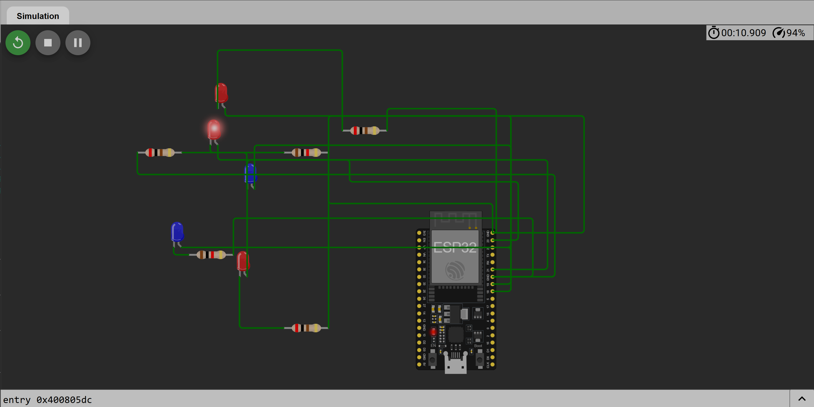

# VoltMind

> A real-time office energy monitoring system powered by simulated devices, a
> shared Next.js backend, a live web dashboard, and a Discord assistant.

## Quick links

- [Problem statement](#problem-statement)
- [Solution approach](#solution-approach)
- [System architecture](#system-architecture)
- [Technologies used](#technologies-used)
- [Current implementation status](#current-implementation-status)
- [Setup and installation](#setup-and-installation)
- [How to run the application](#how-to-run-the-application)
- [Discord bot usage](#discord-bot-usage)
- [API documentation](#api-documentation)
- [Real-time update flow](#real-time-update-flow)
- [Historical energy analytics](#historical-energy-analytics)
- [AI integration](#ai-integration)
- [Project structure](#project-structure)
- [Diagrams](#diagrams)
- [Hardware circuit simulation](#hardware-circuit-simulation)
- [Testing and verification](#testing-and-verification)
- [Known limitations and remaining work](#known-limitations-and-remaining-work)

## Problem statement

The office operates through Discord, but lights and fans are regularly left on
after employees leave. This wastes electricity, increases operating costs, and
is usually discovered too late.

VoltMind must provide one consistent view of the office through both a web
dashboard and a Discord bot. The fixed office setup contains three rooms:

- **Drawing Room** — waiting and visitor area;
- **Work Room 1** — employee workspace; and
- **Work Room 2** — employee workspace.

Each room contains two fans and three lights. The system therefore monitors
**15 devices in total**: six fans and nine lights.

Every device must expose:

- current status: `on` or `off`;
- rated wattage;
- room;
- device name and type; and
- the timestamp of its most recent state change.

Because the project does not use physical hardware, device activity must be
simulated and must change over time. The dashboard must update without a page
refresh, while the Discord bot must answer from the same current state rather
than from hardcoded responses.

## Solution approach

VoltMind uses a deliberately small architecture with one source of truth:

1. An in-memory simulator owns the state of all 15 devices.
2. One or two devices are toggled every 5–15 seconds.
3. Every change updates the device's `status` and `lastChanged` timestamp.
4. The backend derives current power consumption and active alerts from this
   shared state.
5. REST endpoints provide complete snapshots and targeted queries.
6. Server-Sent Events push changes to the dashboard in real time.
7. The Discord bot reads `/api/state`, so it observes the same state as the
   dashboard.
8. Gemini may rewrite verified facts conversationally, but never creates or
   owns device state.
9. MongoDB optionally stores minute-level power samples and device changes for
   historical energy analytics.

This avoids unnecessary databases, queues, microservices, and WebSocket
infrastructure while still satisfying the hackathon's live-data requirements.

## System architecture

```text
Simulated Devices
       │
       ▼
Shared In-Memory Device Store
       │
       ▼
Next.js Backend API
       ├──────── REST snapshots ───────► Discord Bot ─────► Discord User
       │                                      │
       │                                      └── optional Gemini wording
       │
       └── REST + SSE live updates ────► Web Dashboard ───► Dashboard User
```

The dashboard and bot do not maintain independent device stores. Both read from
the same Next.js backend. The editable architecture source is available here:

- [Open the system architecture in Excalidraw](diagrams/system-architecture.excalidraw)

## Technologies used

| Area | Technology | Purpose |
| --- | --- | --- |
| Language | TypeScript 5 | Strictly typed backend, bot, and frontend code |
| Web framework | Next.js 16 App Router | Dashboard and backend route handlers |
| UI runtime | React 19 | Dashboard interface |
| Styling | Tailwind CSS 4 | Frontend styling foundation |
| Real-time transport | Server-Sent Events | One-way live backend-to-dashboard updates |
| History database | MongoDB Atlas | Optional power samples, device events, and actual kWh history |
| Discord integration | discord.js 14 | Bot commands and proactive alert messages |
| AI integration | Google Gen AI SDK | Friendly Discord response wording |
| Default AI model | `gemini-3.5-flash` | Low-latency response humanization |
| Package/runtime tooling | Bun | Dependency installation, scripts, and tests |
| Diagram source | Excalidraw | Editable UX and architecture diagrams |

## Current implementation status

### Completed

- Shared state for 15 devices across three rooms
- Realistic fan and light wattages
- Random state changes every 5–15 seconds
- Device lookup, room filtering, and manual toggle operation
- Office-wide and per-room power calculations
- Estimated eight-hour daily energy consumption
- After-hours alerts outside 9:00 AM–5:00 PM
- All-devices-on and two-hour continuous-running alerts
- REST API and SSE stream
- Discord `!status`, `!room`, and `!usage` command implementation
- Optional Gemini humanization with key failover and factual fallback
- Proactive, deduplicated Discord alert watcher
- Optional MongoDB history with automatic TTL retention
- Actual elapsed-time energy integration and bounded analytics ranges
- Editable dashboard UX and system architecture diagrams
- ESP32-based representative hardware circuit simulation
- Strict TypeScript, lint, and bot formatter verification

### Not yet completed

- Production dashboard UI
- Browser-level SSE and interaction testing
- Final screenshots and three-minute demonstration video

## Setup and installation

### Prerequisites

- [Bun](https://bun.sh/)
- Node.js 20 or newer for deployment compatibility
- A Discord application and bot token for Discord testing
- An optional [Gemini API key](https://aistudio.google.com/app/apikey)

### 1. Clone the repository

```bash
git clone <your-public-repository-url>
cd Techathon2026-VoltMind
```

### 2. Install dependencies

```bash
bun install
```

### 3. Create the environment file

Copy `.env.example` to `.env`:

```powershell
Copy-Item .env.example .env
```

On Bash-compatible systems:

```bash
cp .env.example .env
```

Then replace the placeholder values:

```dotenv
APP_BASE_URL=http://localhost:3000
DISCORD_TOKEN=your_discord_bot_token
DISCORD_CHANNEL_ID=your_alert_channel_id
GEMINI_API_KEY_1=your_first_gemini_api_key
GEMINI_API_KEY_2=your_optional_second_key
GEMINI_API_KEY_3=your_optional_third_key
GEMINI_MODEL=gemini-3.5-flash
MONGODB_URI=your_mongodb_atlas_connection_string
```

Only `DISCORD_TOKEN` is required to start the bot. `DISCORD_CHANNEL_ID` enables
proactive alert posts. Gemini keys are optional because the bot has a
deterministic non-AI fallback. MongoDB is also optional: without a URI, live
state and session energy continue to work, but historical data is not persisted.

### 4. Configure the Discord application

1. Create an application in the Discord Developer Portal.
2. Add a bot to the application.
3. Enable **Message Content Intent**.
4. Invite the bot with permission to view channels, read message history, and
   send messages.
5. Copy the bot token into `DISCORD_TOKEN`.
6. Enable Discord Developer Mode, copy the target channel ID, and place it in
   `DISCORD_CHANNEL_ID`.

Never commit the real `.env` file or expose bot and Gemini credentials.

## How to run the application

The backend/dashboard server and Discord bot run as separate processes because
the bot consumes the same public backend API as the dashboard.

### Terminal 1 — start Next.js

```bash
bun run dev
```

The application is available at <http://localhost:3000>.

### Terminal 2 — start the Discord bot

```bash
bun run bot:start
```

The bot expects the Next.js server at the URL configured by `APP_BASE_URL`.

## Discord bot usage

| Command | Result |
| --- | --- |
| `!status` | Summarizes current fan and light states for all rooms |
| `!room drawing` | Reports the Drawing Room state |
| `!room work1` | Reports the Work Room 1 state |
| `!room work2` | Reports the Work Room 2 state |
| `!usage` | Reports current power and measured today kWh when history is available |

The bot also polls active alerts and can post newly detected alerts once to the
configured channel. Resolved alert IDs are removed from its seen set, allowing
a future recurrence to be announced again.

## API documentation

All endpoints use the Node.js runtime and dynamic responses.

| Method | Endpoint | Description |
| --- | --- | --- |
| `GET` | `/api/state` | Atomic snapshot containing devices, power, and alerts |
| `GET` | `/api/devices` | Lists all 15 devices and their current state |
| `GET` | `/api/devices/room/:name` | Lists devices for one room |
| `POST` | `/api/devices/:id/toggle` | Toggles one device and updates `lastChanged` |
| `GET` | `/api/power` | Returns current and per-room power totals |
| `GET` | `/api/alerts` | Returns all currently active alerts |
| `GET` | `/api/sse` | Streams initial state and subsequent state changes |
| `GET` | `/api/analytics?range=24h` | Returns measured energy and downsampled power history |

Room aliases accepted by the room endpoint include `drawing`, `work1`, and
`work2`. Unknown room names and device IDs return structured `404` responses.

### Example: complete state

```bash
curl http://localhost:3000/api/state
```

```json
{
  "devices": [],
  "power": {
    "totalWatts": 240,
    "perRoom": {
      "Drawing Room": 75,
      "Work Room 1": 90,
      "Work Room 2": 75
    },
    "estimatedDailyKwh": 1.92,
    "devicesOn": 8,
    "devicesOff": 7,
    "measuredAt": "2026-07-03T15:00:00.000Z"
  },
  "alerts": []
}
```

The device and alert arrays above are shortened for documentation. Runtime
responses contain the complete current data.

### Example: room query

```bash
curl http://localhost:3000/api/devices/room/work1
```

### Example: toggle a device

```bash
curl -X POST http://localhost:3000/api/devices/drawing-room-fan-1/toggle
```

### Example: live event stream

```bash
curl -N http://localhost:3000/api/sse
```

## Real-time update flow

When a device changes, `/api/sse` sends a `state-changed` event containing:

- the changed device;
- the latest office and room power summary; and
- the complete current alert list.

New connections immediately receive a `snapshot` event. A heartbeat is emitted
every 25 seconds to keep compatible proxies from closing idle connections.
Event listeners and heartbeat timers are removed when clients disconnect.

## Historical energy analytics

The live device store remains in memory for fast REST and SSE updates. When
`MONGODB_URI` is configured, the runtime additionally stores:

- one aggregate power sample per minute in `power_samples`;
- a `device_events` record only when a device changes state;
- elapsed-time energy in kWh for the office and each room; and
- timestamps suitable for hourly, daily, and weekly charts.

Supported analytics ranges are `1h`, `8h`, `24h`, `7d`, `30d`, and `today`.
Long ranges are grouped into larger time buckets so the dashboard receives a
bounded response rather than every raw document. Power samples expire after 90
days and device events after 30 days through MongoDB TTL indexes.

If MongoDB is not configured or temporarily unavailable, `/api/analytics`
returns the current process's session energy with `persistenceEnabled: false`.
The simulator, REST API, SSE stream, dashboard, and Discord factual fallback
continue operating.

## AI integration

Gemini is used only to humanize already verified Discord facts.

- Default model: `gemini-3.5-flash`
- Configurable using `GEMINI_MODEL`
- Up to three API keys supported for failover
- Low temperature (`0.2`) to reduce factual variation
- Ten-second response cache to limit repeated API calls
- System instruction requires every number, unit, room, and device state to be
  preserved
- Responses are limited to 900 characters
- Deterministic formatted facts are returned if every key fails or no key is
  configured

No model was trained or fine-tuned for this project. There is no retrieval
database and no AI-generated device data. The simulator and backend remain the
only source of operational facts.

## Project structure

```text
app/
├── api/                         Next.js backend route handlers
│   ├── alerts/
│   ├── analytics/
│   ├── devices/
│   ├── power/
│   ├── sse/
│   └── state/
├── globals.css
├── layout.tsx
└── page.tsx                     Dashboard entry point
bot/
├── alert-watcher.ts             Proactive Discord alerts
├── backend.ts                   Shared backend client
├── commands.ts                  Discord command routing
├── formatters.ts                Deterministic factual responses
├── formatters.test.ts
├── index.ts                     Discord client entry point
└── llm.ts                       Optional Gemini humanization
diagrams/
├── dashboard-ux-skeleton.excalidraw
├── system-architecture.excalidraw
└── README.md
lib/
├── alerts.ts                    Computed alert rules
├── constants.ts                 Rooms, wattage, timing, aliases
├── devices.ts                   Shared store and simulator
├── history.ts                   Energy integration and MongoDB history
├── mongodb.ts                   Optional pooled MongoDB connection
├── runtime.ts                   Starts simulator and history recorder
├── snapshot.ts                  Atomic office snapshot
└── types.ts                     Strict domain contracts
```

## Diagrams

- [Dashboard UX skeleton — open editable Excalidraw file](diagrams/dashboard-ux-skeleton.excalidraw)
- [System architecture — open editable Excalidraw file](diagrams/system-architecture.excalidraw)
- [Diagram explanation and editing guide](diagrams/README.md)

To edit a diagram, open <https://excalidraw.com> and drag the corresponding
`.excalidraw` file onto the canvas. Keep the `.excalidraw` files as the editable
sources and export PNG/SVG versions later for static README previews.

## Hardware circuit simulation

The representative one-room circuit uses an ESP32 with five independently
controlled LED loads to model the room's two fans and three lights. Each load
has a current-limiting resistor, and the running simulation demonstrates state
changes from the microcontroller outputs. In a real mains installation, the
ESP32 outputs would drive correctly rated, isolated relay or switching modules
rather than powering fans or lights directly.

[Open the live Wokwi simulation](https://wokwi.com/projects/468537900698064897)



## Testing and verification

Run the non-build checks:

```bash
bun node_modules/typescript/bin/tsc --noEmit
bun run bot:test
bun run lint
```

Current automated verification covers:

- strict TypeScript correctness;
- ESLint rules;
- Discord status formatting;
- room alias resolution and factual room output; and
- usage output preserving backend totals.

The build command is intentionally not included in the current verification
workflow because this project requires explicit approval before running it.

## Known limitations and remaining work

- Current device state resets when the server restarts; historical power and
  event data persist when MongoDB is configured.
- Multiple independent production server instances would not share memory.
- `estimatedDailyKwh` remains an eight-hour projection; `actualEnergyKwh` from
  `/api/analytics` is the measured elapsed-time value.
- The production dashboard interface is still pending.
- Final screenshots, public repository URL, and demonstration video must be
  added before submission.
