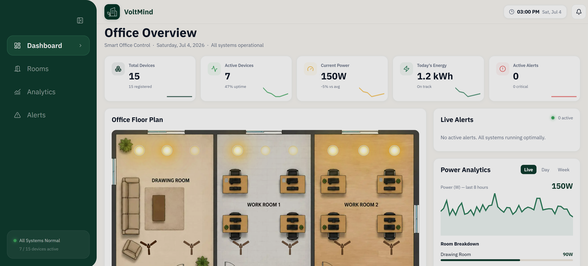
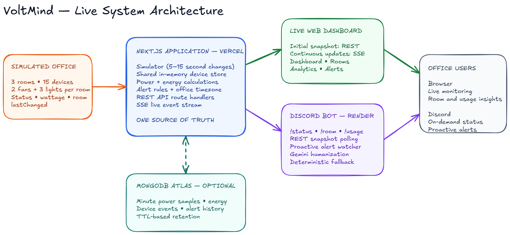
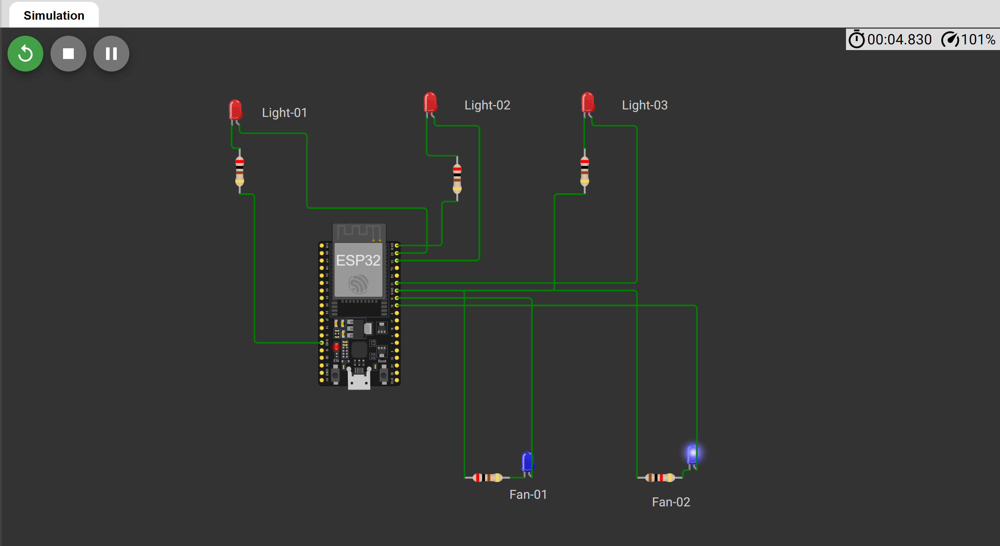

# VoltMind

> A real-time office energy monitoring system that keeps a live web dashboard and a Discord assistant in sync through one shared backend.

[](https://voltmind.atifhasan.com)
[](https://wokwi.com/projects/468537900698064897)

**Live dashboard:** [voltmind.atifhasan.com](https://voltmind.atifhasan.com)



## Problem statement understanding

The challenge describes a small office where most daily communication happens on Discord, but lights and fans are often left running after people leave. The result is wasted electricity, a growing bill, and no simple way to notice the problem early.

The fixed office contains three rooms: **Drawing Room**, **Work Room 1**, and **Work Room 2**. Each room has two fans and three lights, giving VoltMind **15 simulated devices** in total. Every device records its status, wattage, room, type, and last state-change time.

VoltMind solves the visibility gap with two interfaces: a live web dashboard for monitoring the whole office and a Discord bot for quick status checks. Both interfaces read from the same backend, so they always reflect the same simulated office state.

## Solution approach and architecture

VoltMind uses the Next.js application as the single source of truth. A simulator changes one or two device states every 5–15 seconds. The shared backend then recalculates power usage and alert conditions before exposing the latest snapshot through REST APIs and Server-Sent Events (SSE).

The dashboard receives an initial snapshot and continues updating through SSE without a page refresh. The Discord bot, deployed separately on Render, requests the same backend state instead of keeping its own device data. MongoDB Atlas optionally persists power samples, device events, energy totals, and alert history. Gemini only turns verified facts into friendlier Discord messages; it never creates device data or controls the office state.



[Open the editable system architecture diagram](diagrams/system-architecture.excalidraw)

### End-to-end data flow

1. The simulator changes a fan or light in the shared device store.
2. The backend updates `status` and `lastChanged`, then recalculates power and alerts.
3. REST endpoints return complete or filtered snapshots.
4. SSE pushes state and alert changes to the dashboard in real time.
5. The Render-hosted Discord bot requests the same backend snapshot for every command.
6. MongoDB stores historical samples when `MONGODB_URI` is configured.

## Key features

- Live state for 15 fans and lights across three rooms
- Dashboard, room, analytics, and alert views
- Automatic UI updates through Server-Sent Events
- Office-wide and per-room power calculations
- Estimated daily usage and measured historical energy analytics
- After-hours, all-devices-on, and two-hour continuous-running alerts
- Discord commands backed by the same live state as the dashboard
- Proactive, deduplicated Discord alert notifications
- Optional Gemini response humanization with deterministic fallback
- Optional MongoDB history with retention limits
- Representative ESP32 circuit simulation for one room

## Technologies used

| Area                | Technology                    | Use in VoltMind                                |
| ------------------- | ----------------------------- | ---------------------------------------------- |
| Language            | TypeScript 5                  | Strictly typed frontend, backend, and bot      |
| Web application     | Next.js 16, React 19          | Dashboard and API route handlers               |
| Styling             | Tailwind CSS 4, custom CSS    | Responsive dashboard interface                 |
| Real-time updates   | Server-Sent Events            | Backend-to-dashboard state updates             |
| Database            | MongoDB Atlas                 | Power, energy, device-event, and alert history |
| Discord integration | discord.js 14                 | Commands and proactive alerts                  |
| AI integration      | Google Gen AI SDK             | Friendly wording for verified responses        |
| AI model            | `gemini-3.5-flash` by default | Configurable through `GEMINI_MODEL`            |
| Runtime and tooling | Bun                           | Installation, local scripts, and tests         |
| Deployment          | Vercel and Render             | Web/API and Discord bot hosting                |
| Diagrams            | Excalidraw and Wokwi          | System architecture and circuit simulation     |

## Dashboard

The deployed dashboard provides four focused views:

- **Dashboard:** office summary, floor view, current power, device activity, and active alerts
- **Rooms:** room-by-room fan, light, and wattage breakdown
- **Analytics:** historical power and energy charts for 24 hours, 7 days, or 30 days
- **Alerts:** active and recent alert history grouped by severity and time

Open the live application at [voltmind.atifhasan.com](https://voltmind.atifhasan.com).

## Hardware circuit simulation

The Wokwi simulation represents one room with an ESP32 controlling three light indicators and two fan indicators through separate GPIO pins and current-limiting resistors. One representative room is enough for the concept because all three office rooms use the same device layout.

[Open the live Wokwi project](https://wokwi.com/projects/468537900698064897)



The LEDs represent low-voltage simulated loads. A real installation would require isolated, correctly rated relay or switching modules between the ESP32 and mains-powered fans or lights.

## Setup and installation instructions

### Prerequisites

- [Bun](https://bun.sh/) or Node.js 20+
- A Discord application and bot token
- MongoDB Atlas for persistent history (optional)
- A Gemini API key for humanized replies (optional)

### 1. Clone and install

```bash
git clone https://github.com/Atifhasan250/Techathon2026-VoltMind.git
cd Techathon2026-VoltMind
bun install
```

### 2. Configure the environment

Copy `.env.example` to `.env`:

```powershell
Copy-Item .env.example .env
```

Set the values needed for your environment:

```dotenv
APP_BASE_URL=http://localhost:3000
OFFICE_TIMEZONE=Asia/Dhaka

MONGODB_URI=your_mongodb_atlas_connection_string

DISCORD_TOKEN=your_discord_bot_token
DISCORD_CHANNEL_ID=your_alert_channel_id

GEMINI_API_KEY_1=your_first_gemini_api_key
GEMINI_API_KEY_2=your_optional_second_key
GEMINI_API_KEY_3=your_optional_third_key
GEMINI_MODEL=gemini-3.5-flash
```

Only `DISCORD_TOKEN` is required to run the bot. MongoDB, the alert channel, and Gemini are optional. Without Gemini, the bot returns a deterministic factual response. Without MongoDB, live monitoring still works, but historical data is limited to the current server session.

### 3. Configure Discord

1. Create a bot in the Discord Developer Portal.
2. Enable **Message Content Intent**.
3. Invite it with permission to view channels, read message history, and send messages.
4. Add the bot token to `DISCORD_TOKEN`.
5. Add a channel ID to `DISCORD_CHANNEL_ID` to enable proactive alert messages.

Never commit the real `.env` file or expose API keys and bot tokens.

## How to run the application

The dashboard/backend and Discord bot run as separate processes.

### Terminal 1 — dashboard and backend

```bash
bun run dev
```

Open [http://localhost:3000](http://localhost:3000).

### Terminal 2 — Discord bot

```bash
bun run bot:start
```

The bot reads the backend URL from `APP_BASE_URL`. In production, it points to the deployed VoltMind backend.

### Discord commands

| Command         | Response                                                     |
| --------------- | ------------------------------------------------------------ |
| `!status`       | Current fan and light summary for all rooms                  |
| `!room drawing` | Detailed Drawing Room state                                  |
| `!room work1`   | Detailed Work Room 1 state                                   |
| `!room work2`   | Detailed Work Room 2 state                                   |
| `!usage`        | Current power and today's measured or estimated energy usage |

The bot also checks active alerts and posts each newly triggered alert once to the configured Discord channel.

## API endpoints documentation

| Method | Endpoint                   | Purpose                                                            |
| ------ | -------------------------- | ------------------------------------------------------------------ |
| `GET`  | `/api/state`               | Complete atomic snapshot of devices, power, and alerts             |
| `GET`  | `/api/devices`             | All 15 devices and their current state                             |
| `GET`  | `/api/devices/room/:name`  | Devices in one room; accepts aliases such as `drawing` and `work1` |
| `POST` | `/api/devices/:id/toggle`  | Toggle a device and update its `lastChanged` value                 |
| `GET`  | `/api/power`               | Office-wide and per-room power summary                             |
| `GET`  | `/api/alerts`              | Currently active alerts                                            |
| `GET`  | `/api/alerts/history`      | Recent persisted alert history                                     |
| `GET`  | `/api/analytics?range=24h` | Energy totals and downsampled power history                        |
| `GET`  | `/api/sse`                 | Initial snapshot and subsequent live state events                  |

Example requests:

```bash
curl http://localhost:3000/api/state
curl http://localhost:3000/api/devices/room/work1
curl -X POST http://localhost:3000/api/devices/drawing-room-fan-1/toggle
curl -N http://localhost:3000/api/sse
```

Supported analytics ranges are `1h`, `8h`, `24h`, `7d`, `30d`, and `today`.

## AI integration details

VoltMind does not use AI to generate device state. The backend first produces a deterministic response from the real simulated snapshot. Gemini receives only those verified facts and rewrites them in a concise, conversational style.

- Default model: `gemini-3.5-flash`
- Model can be changed through `GEMINI_MODEL`
- No training or fine-tuning was performed
- Runtime prompt-based generation preserves rooms, states, numbers, and units
- Low temperature reduces factual variation
- Up to three API keys are supported for failover
- A short cache reduces repeated API calls
- If every AI request fails, the original deterministic response is returned

This keeps the LLM outside the source-of-truth path: it can improve wording, but it cannot invent or change operational data.

## Project structure

```text
app/
  api/                  Next.js backend routes for state, power, alerts and history
  page.tsx              Live dashboard, rooms, analytics and alerts views
bot/
  backend.ts            Client for the shared VoltMind backend
  commands.ts           Discord command routing
  alert-watcher.ts      Proactive alert polling and deduplication
  llm.ts                Optional Gemini humanization and fallback
lib/
  devices.ts            Shared device state and simulator
  alerts.ts             Alert evaluation and scheduled monitoring
  history.ts            MongoDB persistence and energy integration
  snapshot.ts           Consistent office snapshot
  types.ts              Strict domain and API contracts
diagrams/
  system-architecture.excalidraw
public/
  dashboard-image.png
  system-architecture.png
  wokwi-esp32-room-circuit-simulation.png
wokwi/
  sketch.ino            ESP32 simulation logic
  diagram.json          Wokwi parts and circuit connections
  wokwi-project.txt     Live Wokwi project reference
```

## Testing and verification

Run the non-build checks:

```bash
bun node_modules/typescript/bin/tsc --noEmit
bun test
bun run lint
```

Automated tests cover Dhaka office-hour boundaries, long-running alerts, room aliases, Discord formatting, and preservation of backend power totals. The project uses TypeScript strict mode.

## Known limitations

- Live device state is held in memory and resets when the web runtime restarts.
- MongoDB history is optional; without it, analytics fall back to session data.
- The Wokwi circuit is a representative low-voltage simulation, not a mains-ready electrical design.
- A multi-instance production backend would require a shared live-state store to keep every instance synchronized.

## License

Created for the Techathon 2026 challenge.
